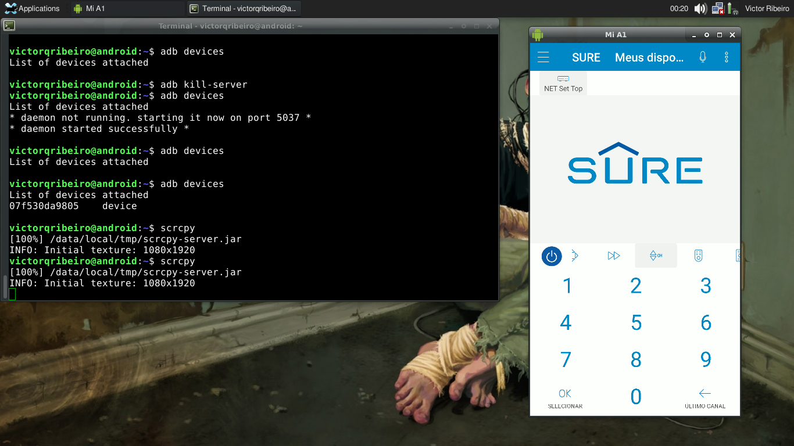
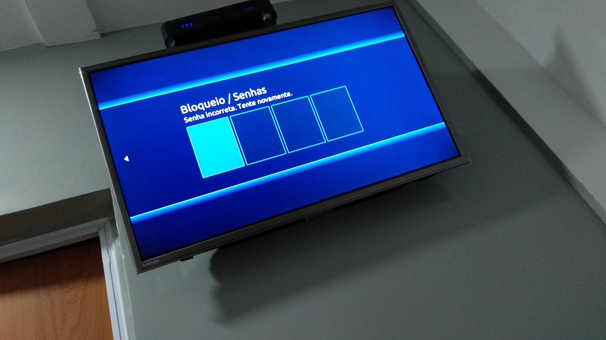

# Brute forcing this Hotel's TV

Well, I'm staying in this hotel and I'm bored. Let's see if we can brute force the TV, just so we can have something to do.



## Tools

adb  
[scrcpy](https://github.com/Genymobile/scrcpy)  
[sure](https://play.google.com/store/apps/details?id=com.tekoia.sure.activities&hl=en_US)  
[pyautogui](https://pypi.org/project/PyAutoGUI/)  
Phone - with IR(Infra Red) capabilities.

## Method

What we are going to do is a very simple thing.

First we are going to install sure (or any other remote control) app on our phones. It's an app that uses the IR functionality on your phone to emulate a remote control

Second we are going to access our phone on our laptop using scrcpy and adb (check their tutorial).

Third we are going to run the code bellow, kick back and watch it run.

## Code

```python
import time
import pyautogui


dict = {
	'0': (x,y),
	'1': (x,y),
	'2': (x,y),
	'3': (x,y),
	'4': (x,y),
	'5': (x,y),
	'6': (x,y),
	'7': (x,y),
	'8': (x,y),
	'9': (x,y),
}

for i in range(10000): #0 - 9999
	for j in "{:04d}".format(i): #format the number so 0 becomes 0000 - 9999
		pyautogui.click( dict[j] )
		time.sleep(0.1) #click the number and wait a while
	time.sleep(0.3) #cool down time
```

The code is very simple. Given that we are seeing our phone screen on our laptop, all we need to do is map a number on the remote control to a location on the screen, then just run a pyautogui script to automaticy click on the proper numbers as the attack goes on. First it's going to click 0000, then 0001, 0002... so on and so forth. Very basic stuff. The (x,y) on the code above means that you should fill in with the x and y coordinates of the buttons on your screen. You can do something more robust, passing the image of the button and having pyautogui searching it for you, but we are doing things quite simple today.


